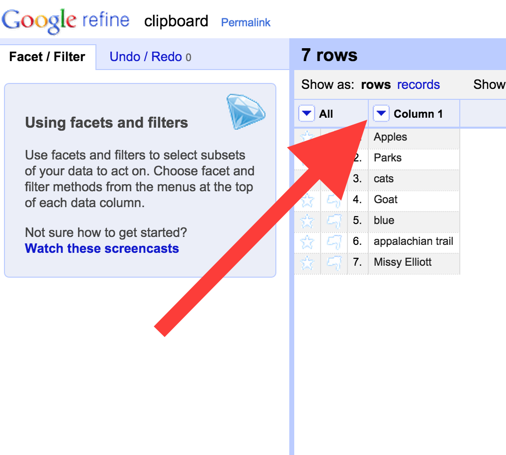
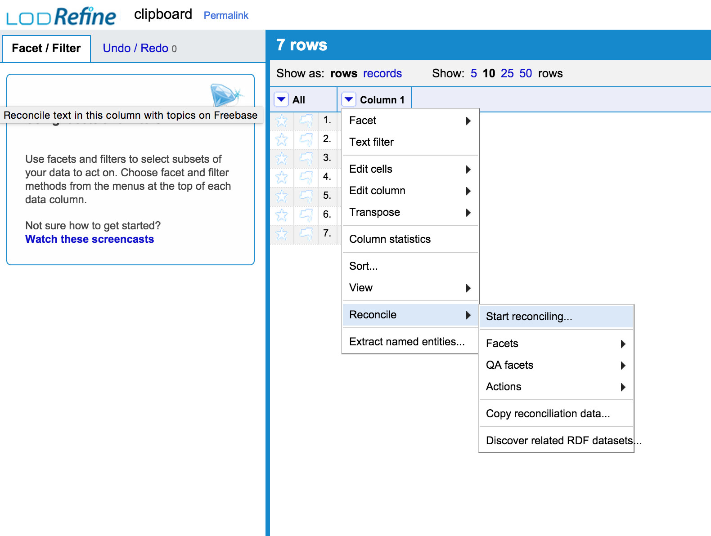

#LODLAM Metadata Portion Installation Instructions

##About

This workshop will primarily work with LODRefine, or OpenRefine with the DERI RDF Extension Installed. There will be possibilities for working with Linked Data Fragments and HDT files in one of the breakout sessions, which will involve other installation requirements, detailed further below.

##LODRefine Installation

The cleaning metadata portion of this workshop will primarily work with LODRefine (Linked Open Data Refine) or an instance of OpenRefine with the DERI RDF Extension added.

Follow the choose your adventure below for getting LODRefine installed on your computer. Review all the options available before going immediately to the first step; there are a number of ways you can setup this tool.

After installation, please run the simple test below to ensure your LODRefine installation is ready for the workshop.

Note: We will discuss more about how OpenRefine/LODRefine works during the metadata cleaning portion of the workshop, but it is important to realize now that OpenRefine runs with all data saved in memory - it does not use a database of some sort. This means there will be performance issues with bigger datasets and when reconciling against locally-stored datasets, especially dependent on the memory available in your work environment. 

If you have any issues with the following, please do not hesitate to contact Christina at cmharlow@gmail.com or @cm_harlow on Twitter.

###Requirements no matter what:

OpenRefine is built with java. You will need Java JRE install. Mac and Linux machines will need to have Java 6 or 7 installed (if you have Java 8, and don't want to mess with Java 6 or 7, try grabbing LODRefine from GitHub and running via the Command Line Interface/client of your choice first).

Java JRE isn't hard to install, but takes forever to download, especially on conference wifi. You are forewarned.

###Option 1: Have OpenRefine/Google Refine Already Installed?

You already have OpenRefine (possibly still labeled Google Refine) on your computer, and it works for you. Great! You just need to install the DERI Extension manually (which isn't too hard, despite being 'manual').

####Install DERI RDF Extension Manually

1. Find where your OpenRefine installation is on your computer. If you're not sure:
    2. Start OpenRefine however you normally do (click on the diamond icon or the exectuable file).
    3. In the OpenRefine start screen, click on the 'Browse workspace directory' link in the bottom left corner (see below, is same for Google Refine, OpenRefine, or LODRefine):
    
    4. This should the file directory where your installation of OpenRefine is located on your computer. If there isn't already a subdirectory named 'extensions', create it. Note where this is located.
    2. Shut down OpenRefine.
2. Download the DERI RDF Extension v.0.8.0 from [here](http://refine.deri.ie/) to your computer, then move to the OpenRefine 'extensions' sub-directory you just created. Unzip the file.
3. Restart OpenRefine however you normally do. The RDF options button should now show up in the top right corner when you look at an OpenRefine project (see below):

4. Go to the 'Test your install' section and make sure you're ready to go.

###Option 2: Don't Have OpenRefine or LODRefine Installed Already?

No worries! We'll get you set up. 

There are a few options for getting LODRefine onto your computer. If you prefer to keep the installation and start-up as simple as possible, use one of the OpenRefine installers detailed in Option 2a, below. If you're prefer to work with a version of LODRefine that runs via command line interface and feel comfortable with Git and handling installation of dependencies, clone a LODRefine repository as detailed in Option 2b, below.

Both methods should get you an installation of OpenRefine/LODRefine ready for the workshop.

####Option 2a: Install OpenRefine via Installer + Add DERI RDF Extension Manually

This versions works more slowly, but comes with a packaged installer.

1. Go to the [OpenRefine Site Download Page](http://openrefine.org/download.html).
2. Download the OpenRefine file for your operating system and follow the instructions there (the release/stable version will install still as 'Google Refine' - this is okay).
    2. For Windows: Download, unzip, and double-click on openrefine.exe. If you’re having issues, try double-clicking on refine.bat instead.
    3. For Mac: Download, open, drag icon into the Applications folder and double click on it. If you get the error: 'this file is damaged should be moved to trash' (or something similar), do the following:
        4. Open System Preferences
        5. Open Security & Privacy
        6. Go to the General Tab
        7. Change the "Allow applications downloaded from:" setting to "Anywhere" 
        8. You should be able to able to open OpenRefine now.
    3. For Linux: Download, extract, then type ./refine to start. 
4. Once you've got OpenRefine installed and running on your machine, you need to now install the DERI RDF Extension. Go to Option 1, above, and follow the steps for 'Install DERI RDF Extension Manually'.

####Option 2b: Install LODRefine from GitHub/Source

Alternatively, you can install LODRefine (a version of OpenRefine 2.5 with the DERI RDF extension among others already installed) by downloaded or git cloning then building LODRefine locally. 

1. Clone or download LODRefine:
    2. From GitHub, clone the master branch of this repository: https://github.com/sparkica/LODRefine
    3. From Sourceforge, download the most recent version of LODRefine: http://sourceforge.net/projects/lodrefine/postdownload?source=dlp
3. Move LODRefine to wherever on your computer you'd like to run it from. I usually keep these sorts of applications in a directory call 'Tools'.
4. Change into that LODRefine directory in some kind of command line interface or client (e.g. Terminal on Mac, Command Prompt in Windows), and start LODRefine by typing:
    6. On Mac/Linux:
    ```
    $ ./refine
    ```
    7. On Windows:
    ```
    refine
    ```
6. Leave the Command Line Interface running while working with LODRefine. Go to your preferred web browser (**not Internet Explorer**), and navigate to http://127.0.0.1:3333/. 
7. When you're done, go back to the Command Line Interface client where LODRefine is running, and type 'cntl+C'. This will stop LODRefine. 
8. Go to the 'Test your install' section and make sure you're ready to go.

###Option 3: Don't Want to Install OpenRefine right now?

I'm working with RefinePro, a company that runs cloud-hosted instances of OpenRefine, to get OpenRefine with the DERI RDF extensions working for a back up possibility.

At present, RefinePro does have instances of OpenRefine with the DERI RDF extensions installed, but the RDF reconciliation services sometimes don't work.

If you want to try a cloud-based version and see if it works for you instead of going through installation instructions above, you can get a free month trial to RefinePro. Follow these steps:

1. Go to [the RefinePro site](https://app.refinepro.com/register/) and register. 
2. On that registration page, for the 'Community' portion, choose 'DST4L-EU'. This will get you an instance of OpenRefine with the DERI RDF Extension installed.
3. When done, enter. You'll get a free month trial.
3. Respond to the email confirmation. This should take you back to the RefinePro login. 
4. Logging in takes you to your dashboard. Choose to start an instance - this will create an OpenRefine instance. 
5. Once an instance available on your dashboard, click on 'Start'. Once it is starting, click on 'Access this RefinePro instance', a link that appears once your OpenRefine instance is running.
6. This should take you to OpenRefine.
7. Go to the 'Test your install' section and make sure you're ready to go.

##Test Your Install

To make sure you're ready to go for the LODLAM metadata cleaning portion of the day, perform the following steps:

1. Start OpenRefine/LODRefine however you normally do (either by clicking the Diamond logo where you've stashed OpenRefine, or using the refine command in a Command Line Interface).
2. If it doesn't pop up for you automatically, go to http://127.0.0.1:3333 in your web browser of choice (not Internet Explorer). 
3. Go to 'Create Project' > 'Clipboard'. Copy and paste in the following:
```
English
eng
latin
gaelic
mandarin
espéranto
welsh
```
4. Click on 'Next'.
5. The sample above should appear as a 'Line-based text files', with each language in a new row. See below:

6. Click on 'Create Project' in top right corner of screen. Your OpenRefine Project should now appear.
9. Go to "RDF" > "Add reconciliation service" > "Based on RDF-file..." (see below):

10. Enter the following information:
    11. Name: MARC Languages
    12. Load file from URL: https://raw.githubusercontent.com/cmh2166/LODLAMmetadataDLF15/master/Data/languages.nt
    13. File format: N-Triple
    14. Label properties: uncheck 'rdfs:label', check Other, then add: 
    http://www.loc.gov/mads/rdf/v1#authoritativeLabel
    15. Click "OK".
16. Now go to Column 1. Click on the arrow at the top of that column (see below):

17. In the drop down menu, hover over 'Reconcile' > Click on 'Start reconciling...' (see below):

18. Click on 'MARC Languages'. 


