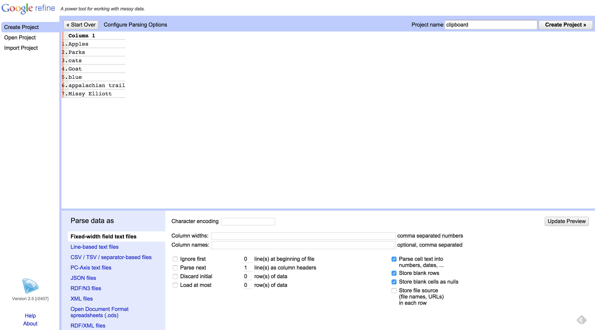

# LODLAM Workshop: Metadata Cleaning Portion Installation Instructions

## About

### Required Preparation
This workshop will primarily work with **LODRefine** (Linked Open Data OpenRefine), or **OpenRefine** with the **DERI RDF Extension** installed. OpenRefine requires Java (see note below in Installation instructions) and a web browser to run in (**Not Internet Explorer**).

There are tests to make sure you installations are ready to go on workshop day in this document as well.

### Optional Preparation
Additionally, if you want to perform the local reconciliation parts of the workshop (and because we'll be working with conference wi-fi, *this is recommended*), please install and/or setup on your computer **Python** (>=2.7) and **Pip** (or other Python package manager). 

We might work with **Linked Data Fragments** and **HDT** files in one of the clinic sessions, which will involve other installation requirements, detailed further below. Those are optional, obviously, but good to have installed and ready if you're interested in learning more about working with those technologies (along with **Heroku** if you'd like to push your LDF server or client to the web).

### Need Help?
If you have any issues with the following, please do not hesitate to contact Christina at cmharlow@gmail.com or @cm_harlow on Twitter. We can work issues out over email or set up a Google Hangout time for me to see the errors and try to help that way.

## Required Installation: LODRefine
The cleaning metadata portion of this workshop will primarily work with LODRefine (Linked Open Data Refine) or an instance of OpenRefine with the DERI RDF Extension added.

Follow the choose your adventure below for getting LODRefine installed on your computer/work environment. Review all the options available before going immediately to the first step; there are a number of ways you can setup this tool.

After installation, please run the test below to ensure your LODRefine installation is ready for the workshop.

**Nota bene:** We will discuss more about how OpenRefine/LODRefine works during the metadata cleaning portion of the workshop, but it is important to realize now that OpenRefine runs with all data saved in memory - it does not use a database of some sort. This means there will be performance issues with bigger datasets and when reconciling against locally-stored RDF documents, especially dependent on the memory available in your work environment. 

### Java Requirements:
OpenRefine is built in Java. You will need Java JRE. Mac and Linux machines will need to have Java 6 or 7 installed (if you have Java 8, and don't want to mess with Java 6 or 7, try grabbing LODRefine from GitHub and running via the Command Line Interface/client of your choice first, this sometimes is a work-around).

**Java JRE isn't hard to install, but takes forever to download, especially on conference wifi. You are forewarned.**

### Option 1: Have OpenRefine/Google Refine Already Installed?

You already have OpenRefine (possibly still labeled Google Refine) on your computer, and it works for you. Great! You just need to install the DERI Extension manually (which isn't too hard, despite being 'manual').

#### Install DERI RDF Extension Manually

1. Find where your OpenRefine installation is on your computer. If you're not sure:
    2. Start OpenRefine however you normally do (click on the diamond icon or the exectuable file).
    3. In the OpenRefine start screen, click on the 'Browse workspace directory' link in the bottom left corner (see below, is same for Google Refine, OpenRefine, or LODRefine):
    
    4. This should the file directory where your installation of OpenRefine is located on your computer. If there isn't already a subdirectory named 'extensions', create it. Note where this is located.
    2. Shut down OpenRefine.
2. Download the DERI RDF Extension v.0.8.0 from [here](http://refine.deri.ie/) to your computer, then move to the OpenRefine 'extensions' sub-directory you just created. Unzip the file.
3. Restart OpenRefine however you normally do. The RDF options button should now show up in the top right corner when you look at an OpenRefine project (see below):

4. Go to the 'Test your install' section and make sure you're ready to go.

### Option 2: Don't Have OpenRefine or LODRefine Installed Already?

No worries! We'll get you set up. 

There are a few options for getting LODRefine onto your computer. If you prefer to keep the installation and start-up as simple as possible, use one of the OpenRefine installers detailed in Option 2a, below. If you're prefer to work with a version of LODRefine that runs via command line interface and feel comfortable with Git and handling installation of dependencies, clone a LODRefine repository as detailed in Option 2b, below.

Both methods should get you an installation of OpenRefine/LODRefine ready for the workshop. Option 2b has the possible benefit of running a bit faster and showing what exactly LODRefine is doing in the back end, if you're interested in that.

#### Option 2a: Install OpenRefine via Installer + Add DERI RDF Extension Manually

This versions works more slowly, but comes with a packaged installer/icon.

1. Go to the [OpenRefine Site Download Page](http://openrefine.org/download.html).
2. Download the OpenRefine file for your operating system and follow the instructions there (the release/stable version will install still as 'Google Refine' - this is okay).
    2. For Windows: Download, unzip, and double-click on openrefine.exe. If you’re having issues, try double-clicking on refine.bat instead.
    3. For Mac: Download, open, drag icon into the Applications folder and double click on it. If you get the error: 'this file is damaged should be moved to trash' (or something similar), do the following:
        4. Open System Preferences
        5. Open Security & Privacy
        6. Go to the General Tab
        7. Change the "Allow applications downloaded from:" setting to "Anywhere" 
        8. You should be able to able to open OpenRefine now.
    3. For Linux: Download, extract, then type ./refine to start. 
4. Once you've got OpenRefine installed and running on your machine, you need to now install the DERI RDF Extension. Go to Option 1, above, and follow the steps for 'Install DERI RDF Extension Manually'.

#### Option 2b: Install LODRefine from GitHub/Source

Alternatively, you can install LODRefine (a version of OpenRefine 2.5 with the DERI RDF extension among others already installed) by downloading or git cloning LODRefine locally. 

1. Clone or download LODRefine:
    2. From GitHub, clone the master branch of this repository: https://github.com/sparkica/LODRefine
    3. From Sourceforge, download the most recent version of LODRefine: http://sourceforge.net/projects/lodrefine/postdownload?source=dlp
3. Move LODRefine to wherever on your computer you'd like to run it from. I usually keep these sorts of applications in a directory call 'Tools'.
4. Change into that LODRefine directory in some kind of command line interface or client (e.g. Terminal on Mac, Command Prompt in Windows,...), and start LODRefine by typing:
    6. On Mac/Linux:
    ```
    $ ./refine
    ```
    7. On Windows:
    ```
    refine
    ```
6. Leave the Command Line Interface running while working with LODRefine. Go to your preferred web browser (**not Internet Explorer**), and navigate to http://127.0.0.1:3333/. 
7. When you're done, go back to the Command Line Interface client where LODRefine is running, and type 'cntl+C'. This will stop LODRefine. 
8. Go to the 'Test your install' section and make sure you're ready to go.

### Option 3: Don't Want to Install OpenRefine right now?
I'm working with RefinePro, a company that runs cloud-hosted instances of OpenRefine, to get OpenRefine with the DERI RDF extensions working for a back up possibility.

At present, RefinePro does have instances of OpenRefine with the DERI RDF extensions installed, but the RDF reconciliation services sometimes don't work.

If you want to try a cloud-based version and see if it works for you instead of going through installation instructions above, you can get a free month trial to RefinePro. Follow these steps:

1. Go to [the RefinePro site](https://app.refinepro.com/register/) and register. 
2. On that registration page, for the 'Community' portion, choose 'DST4L-EU'. This will get you an instance of OpenRefine with the DERI RDF Extension installed.
3. When done, enter. You'll get a free month trial.
3. Respond to the email confirmation. This should take you back to the RefinePro login. 
4. Logging in takes you to your dashboard. Choose to start an instance - this will create an OpenRefine instance. 
5. Once an instance available on your dashboard, click on 'Start'. Once it is starting, click on 'Access this RefinePro instance', a link that appears once your OpenRefine instance is running.
6. This should take you to OpenRefine.
7. Go to the 'Test your install' section and make sure you're ready to go.

### Test Your LODRefine Install
To make sure you're ready to go for the LODLAM metadata cleaning portion of the day, perform the following steps:

1. Start OpenRefine/LODRefine however you normally do (either by clicking the Diamond logo where you've stashed OpenRefine, or using the refine command in a Command Line Interface or client).
2. If OpenRefine in a browser window doesn't pop up for you automatically, go to http://127.0.0.1:3333 in your web browser of choice (**not Internet Explorer**). 
3. Go to 'Create Project' > 'Clipboard'. Copy and paste in the following:
```
Apples
Parks
cats
Goat
blue
appalachian trail
Missy Elliott
```

4. Click on 'Next'.
5. The sample above should appear as a 'Line-based text files', with each language in a new row. See below:

6. If that looks right, click on 'Create Project' in top right corner of screen. Your OpenRefine Project should now appear.
9. Go to "RDF" > "Add reconciliation service" > "Based on SPARQL Endpoint..." (see below):

10. We will be testing our RDF extension by using the [Free Your Metadata LCH SPARQL Endpoint](http://freeyourmetadata.org/reconciliation/). In the dialog box that appeared from the last step, enter the following information:
    11. Name: LCSH
    12. Endpoint URL: http://sparql.freeyourmetadata.org/
    13. Graph URI: http://id.loc.gov/authorities/subjects
    14. Type: Virtuoso
    14. Label properties: uncheck 'rdfs:label', check 'skos:prelLabel'
15. Click "OK". This may take a few seconds to a few minutes to be generated, but it should return you back to the project screen.

16. Now go to Column 1 in our test project. Click on the arrow at the top of that column (see below):

17. In the drop down menu, hover over 'Reconcile' > Click on 'Start reconciling...' (see below):

18. In the reconciliation services dialog box that appears, click on 'LCSH'. This **will** take a few minutes to generate the service for you, more depending on how busy the SPARQL endpoint is.

19. What should appears it the following, with skos:Concept checked.
    20. If this doesn't appear for you (instead it says something like 'no types found'), try checking "Reconcile against no particular type" instead and seeing if that works for you. 
21. Click 'Start Reconciling'. 

22. You should now have a yellow box telling you the Reconciliation is working. If you are running a version of LODRefine started via a command line interface/client, go check out the CLI/client now to see just how LODRefine is calling up the reconciliation service.

23. If you got results like seen below, then HOORAY YOU'RE READY TO GO. If you didn't, get in touch with [Christina](mailto:cmharlow@gmail.com).


In between now and the workshop, please do feel free to play around with the DERI RDF extension - either the reconciliation options we checked above, or the 'edit RDF skeleton' functions. You don't need to understand what they are doing; we'll dig into that in the workshop.

## Optional Installations

The following is optional for the workshop. If you want to work with reconciliation services in OpenRefine, I strongly recommend you get the Python local reconciliation service requirements installed and run the test. 

### RDF Editors
What we create in the process of this workshop will be a RDF document that you might want to see how it looks outside of LODRefine. 

If you just want a nice editor for reviewing & basic edits of RDF:

- Any text editor can do this - even just TextEdit.
- Most editors like Notepad++ or Sublime have decent interfaces and either native support or good packages for different RDF serialization highlighting
- We might play with web-based tools like [RDF Distiller](http://rdf.greggkellogg.net/distiller) if time for things like RDF serialization conversion
- If you really want to get into RDF ontology editing, there is [Protégé](http://protegewiki.stanford.edu/wiki/Main_Page) - available in an either [web-based version](http://webprotege.stanford.edu/) or for [download](http://protege.stanford.edu/products.php#desktop-protege) - and [Vitro](http://vitro.mannlib.cornell.edu/) (only available for download and installation).

### Python Local Reconciliation Service Requirements
If you are interested in running many/more of the reconciliation service functions we'll see (whether they leveraged Linked Open Data or not), install the following.

This can be move involved installation-wise, so please don't hesitate to ask [Christina](mailto:cmharlow@gmail.com) if you have questions. We can also take a lunch or coffee break at DLF if necessary to debug this.

#### Installation
**Python**
Install or ensure that you have at least python 2.7 installed on your computer. 

You can check if your computer has python installed by going to your command line interface or client (standard on a Mac is Terminal, on Windows, the Command Prompt; if you have Linux, I'm assuming you know how to make Linux work), then type in 'python --version'. If it gives you a response such as 'Python 2.7.10', you're good to move on. If it doesn't, the Python beginner's documentation is your friend: https://wiki.python.org/moin/BeginnersGuide/Download

**Pip**
Different LODRefine reconciliation services built in Python require different Python libraries to run (although there are a number of libraries that are pretty standard across services). Because you this, you probably want a Python package manager like Pip to easily handle installing requirements. This should come automatically with Python 2.7.9 and later.

You can check if your computer has pip installed by going to your command line interface or client, then type in 'pip --version'. If it gives you a response such as 'pip 7.1.2 from /usr/local/lib/python2.7/site-packages (python 2.7)', you're good to move on. 

If it doesn't, the Pip insatllation documentation is your friend: https://pip.pypa.io/en/latest/installing/

#### Test
Try either git cloning or downloading this OpenRefine reconciliation service and running through the instructions: https://github.com/cmh2166/geonames-reconcile

### Linked Data Fragments Server/Client Installation
[Linked Data Fragments](http://linkeddatafragments.org/) will not be a part of the metadata cleaning workshop, but it will be mentioned in passing and discussed possibly in the clinic portion. Mainly, its a new-fangled, awesome project that I want to mention in passing.

In particular, in the context of metadata cleanup, Linked Data Fragments offers one way to approach better performance of reconciliation with and querying of RDF datasets - whether they be the traditional library authorities like Getty AAT or Library of Congress, or your own local authorities.

#### Installation
If you'd like to try running your own Linked Data Fragments Server (supplying your own or other RDF data), you will need to [install [**Node.js** (preferably v0.10.x) and **NPM**, the Node package manager](https://docs.npmjs.com/getting-started/installing-node). See the instructions linked to.

If you really don't want to use Node, there are [LDF Server applications written in other languages available (Java, NetKernel)](http://linkeddatafragments.org/software/#server), but they will not offer all the functionalities available in the Node.js version, nor will I really be able to help debug issues with the other versions as I've just worked with the Node.js version.

Once Node and NPM is installed, to install a LDF Server on your computer, follow the instructions here: https://github.com/LinkedDataFragments/Server.js. Don't worry about configuring the data sources - you can use the default they provide. If you have issues installing the HDT requirement, skip it. It has some known bugs/confusion.

The above will install a LDF Server locally. If you'd like to then push that LDF Server to the web using Heroku ([here is an example](http://aqueous-eyrie-5164.herokuapp.com/)), follow **just the first 2 steps - Introduction and Setup** [on this page.](https://devcenter.heroku.com/articles/getting-started-with-nodejs#introduction)


