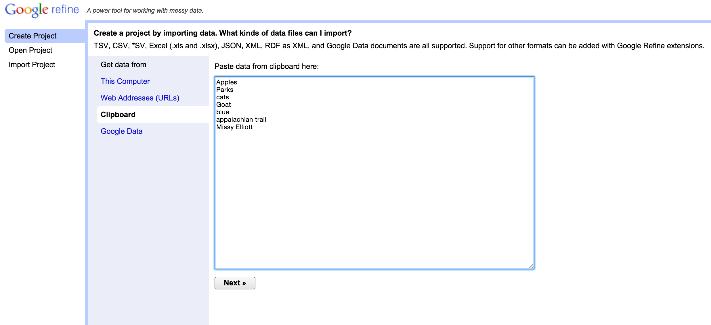
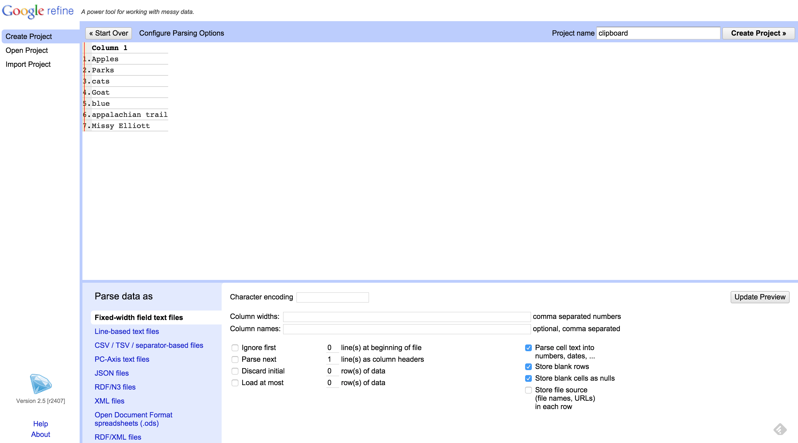
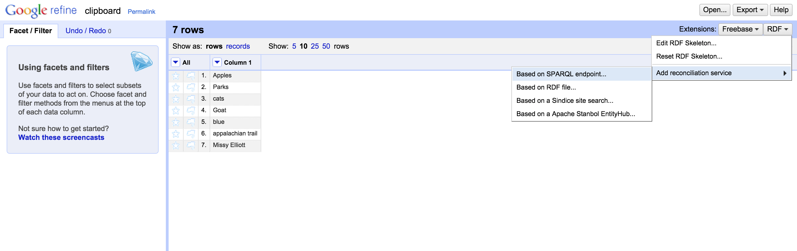
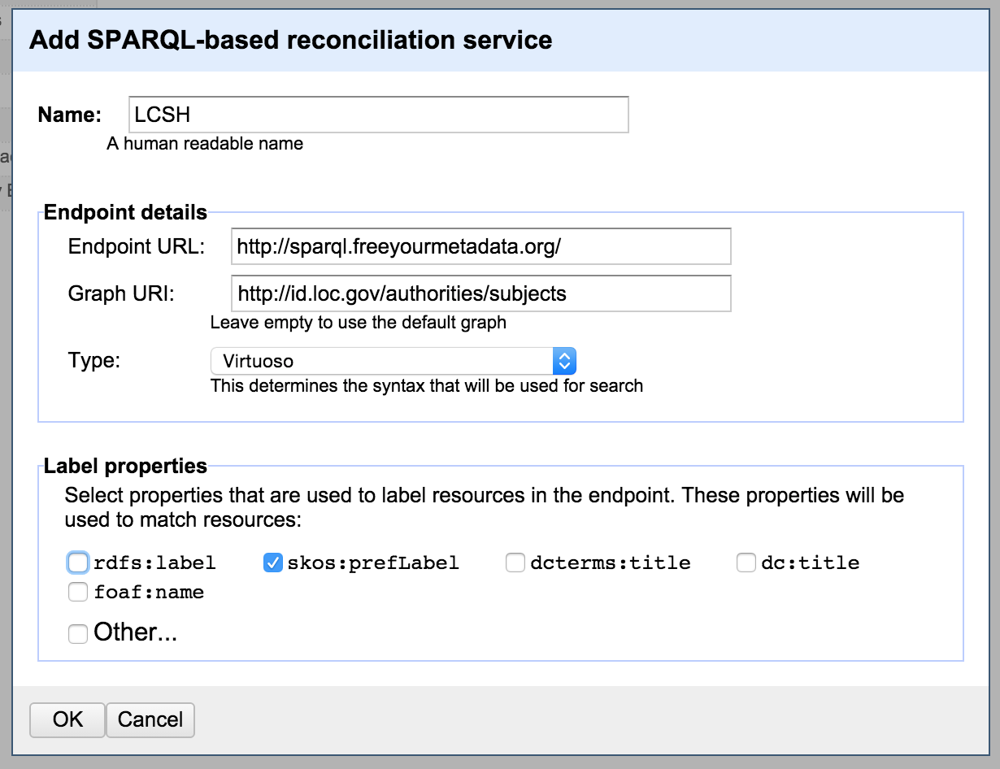
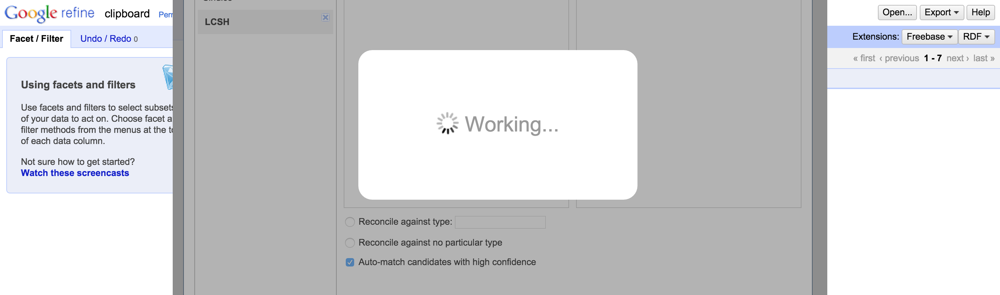
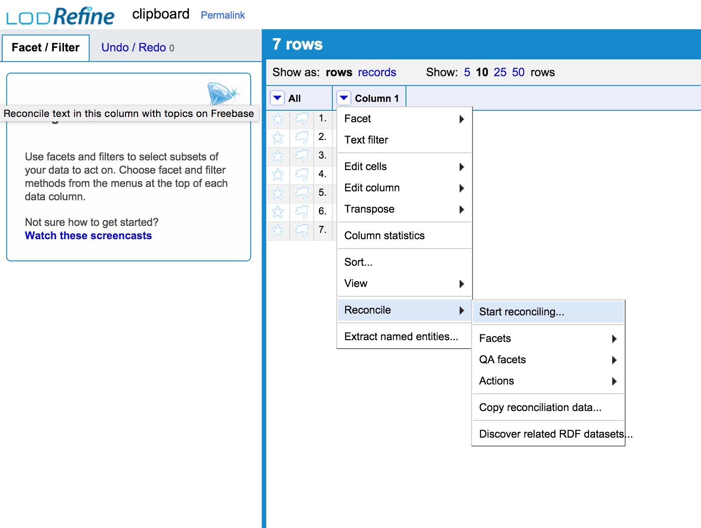
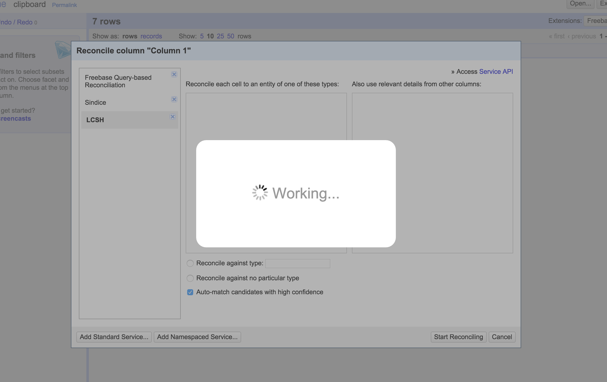
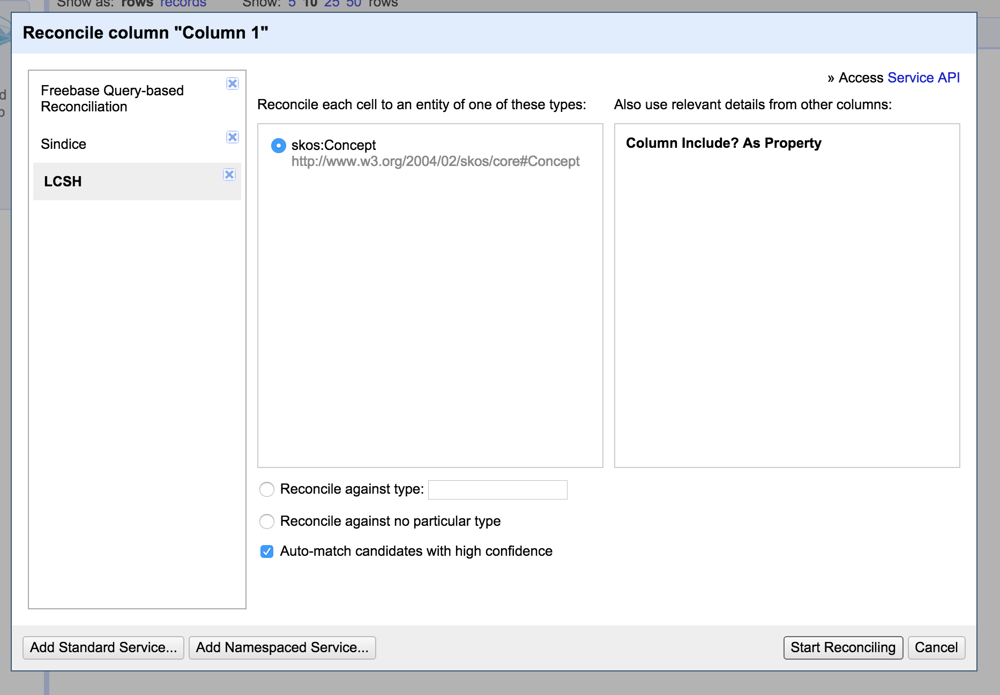
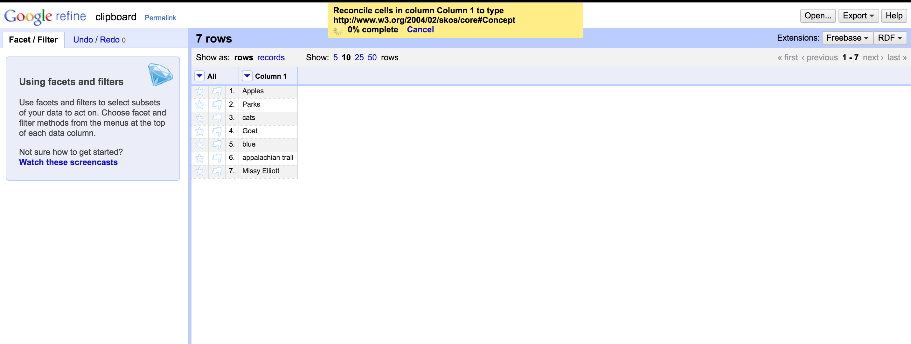
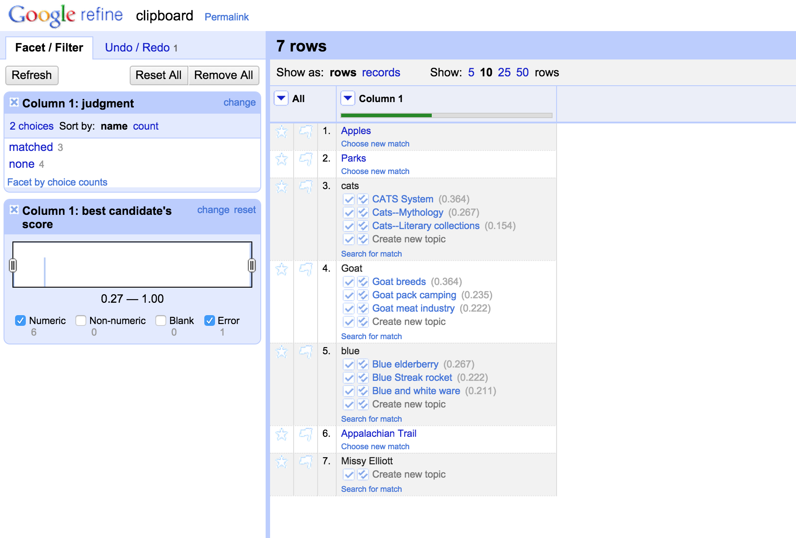

# LODLAM Workshop: Metadata Cleaning Portion Installation Instructions
## Test Your LODRefine or OpenRefine + DERI RDF Extension Install
To make sure you're ready to go for the LODLAM metadata cleaning portion of the day, perform the following steps:

1. Start OpenRefine/LODRefine however you normally do (either by clicking the Diamond logo where you've stashed OpenRefine, or using the refine command in a Command Line Interface or client).
2. If OpenRefine in a browser window doesn't pop up for you automatically, go to http://127.0.0.1:3333 in your web browser of choice (**not Internet Explorer**). 
3. Go to 'Create Project' > 'Clipboard'. Copy and paste in the following:
    ```
    Apples
    Parks
    cats
    Goat
    blue
    appalachian trail
    Missy Elliott
    ```


4. Click on 'Next'.
5. The sample above should appear as a 'Line-based text files', with each language in a new row. See below:


6. Once your OpenRefine project has loaded, click on 'Create Project' in top right corner of screen. Your OpenRefine Project should now appear.
9. Go to "RDF" > "Add reconciliation service" > "Based on SPARQL Endpoint..." (see below):


10. We will be testing our RDF extension by using the [Free Your Metadata LCH SPARQL Endpoint](http://freeyourmetadata.org/reconciliation/). In the dialog box that appeared from the last step, enter the following information:
    11. Name: LCSH
    12. Endpoint URL: http://sparql.freeyourmetadata.org/
    13. Graph URI: http://id.loc.gov/authorities/subjects
    14. Type: Virtuoso
    14. Label properties: uncheck 'rdfs:label', check 'skos:prelLabel'
    

15. Click "OK". This may take a few seconds to a few minutes to be generated, but it should return you back to the project screen.
16. Now go to Column 1 in our test project. Click on the arrow at the top of that column (see below):


17. In the drop down menu, hover over 'Reconcile' > Click on 'Start reconciling...' (see below):


18. In the reconciliation services dialog box that appears, click on 'LCSH'. This **will** take a few minutes to generate the service for you, more depending on how busy the SPARQL endpoint is.


19. What should appears it the following, with skos:Concept checked.
    20. If this doesn't appear for you (instead it says something like 'no types found'), try checking "Reconcile against no particular type" instead and seeing if that works for you. 
21. Click 'Start Reconciling'. 


22. You should now have a yellow box telling you the Reconciliation is working. If you are running a version of LODRefine started via a command line interface/client, go check out the CLI/client now to see just how LODRefine is calling up the reconciliation service.


23. If you got results like seen below, then HOORAY YOU'RE READY TO GO. If you didn't, get in touch with [Christina](mailto:cmharlow@gmail.com).


In between now and the workshop, please do feel free to play around with the DERI RDF extension - either the reconciliation options we checked above, or the 'edit RDF skeleton' functions. You don't need to understand what they are doing; we'll dig into that in the workshop.

Next step: Go check out the [optional preparation](OptionalPrep.md) now, or relax until workshop day.

Questions? Get in touch with [Christina](mailto:cmharlow@gmail.com).

[Back to the Metadata Cleaning Agenda](../)

[Back to the LODLAM Workshop Agenda](https://github.com/cmh2166/DLF15LODLAM/)
